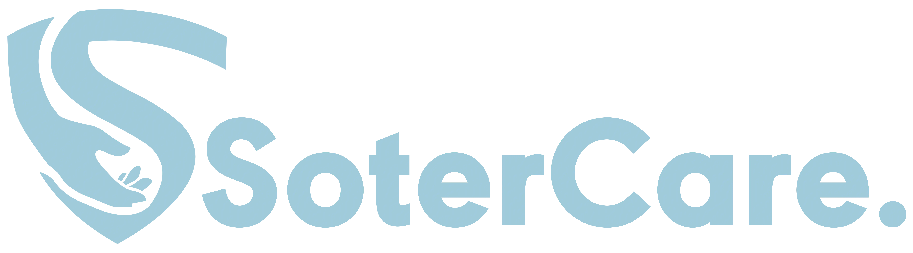
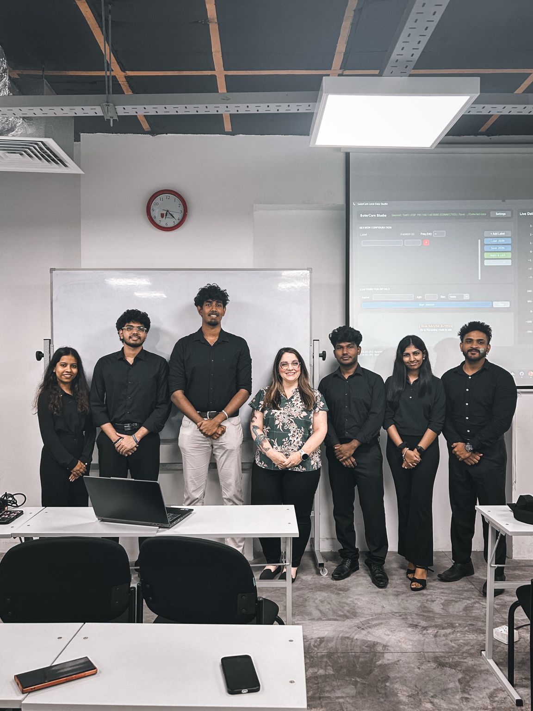
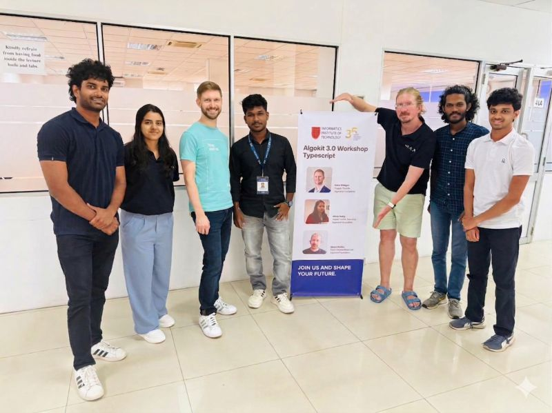
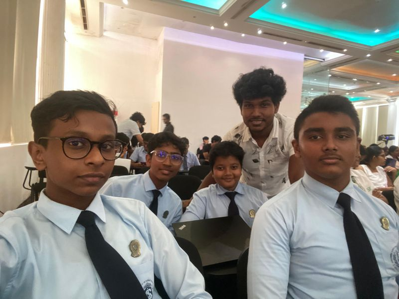
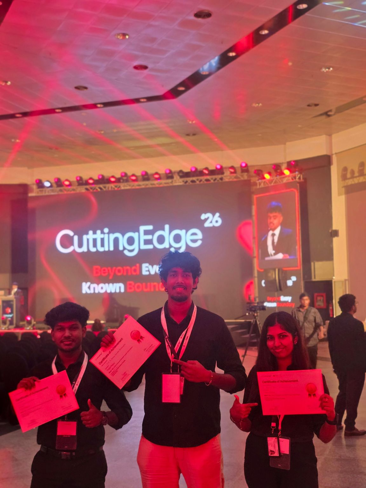
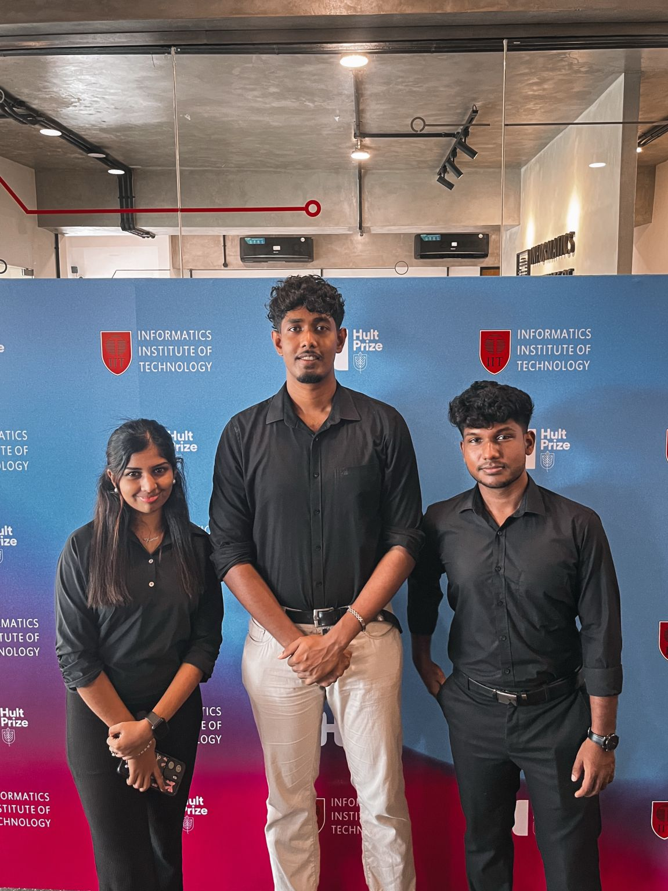
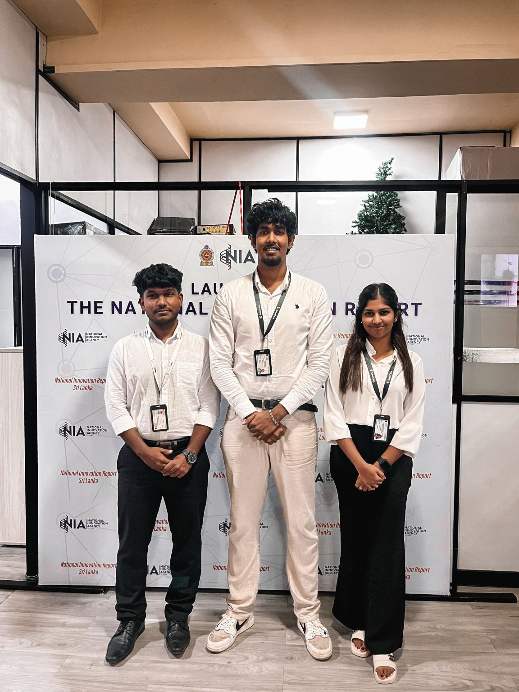

<picture>
  <source media="(prefers-color-scheme: dark)" srcset="assets/SoterCare-Primary-logo-white.webp">
  
</picture>

### Wellness Simplified

**The community hub of SoterCare — a student-led AI, Cloud, IoT, Healthcare & Open Source community.**

---

Welcome to the **SoterCare Community repository** — the home of everything we do together as a community: events, workshops, hackathons, guides, templates, and resources. If you want to learn, build, speak, volunteer, or organize, you're in the right place.

## 📚 Table of Contents

- [Mission](#-mission) · [About](#-about-the-community) · [What We Do](#%EF%B8%8F-what-we-do) · [Values](#-community-values)
- [Events](#-events) · [Workshops](#-workshops) · [Open Source Programs](#%EF%B8%8F-open-source-programs) · [Hackathons](#-hackathons)
- [Get Involved](#-ways-to-get-involved) · [Impact](#-community-impact) · [Partners](#-community-partners)
- [Maintainers](#-maintainers) · [Useful Links](#-useful-links)

## 🎯 Mission

To empower students to build meaningful, open technology — especially in healthcare — by learning together, shipping real projects, and lifting each other up through mentorship and community.

## 💙 About the Community

SoterCare is a student-led developer community working at the intersection of **Artificial Intelligence, Cloud Computing, IoT, Healthcare, and Open Source**. We build real-world technology in the open, and we use everything we build as an opportunity to teach: every project, event, and workshop is a chance for a student to learn something they couldn't learn in a classroom.

This repository is our community's public home. Our product code lives in the org's other repositories — this is where the *people* side lives.

## 🛠️ What We Do

- **Build in the open** — healthcare technology projects across AI, IoT, cloud, web, and mobile
- **Teach what we learn** — workshops, bootcamps, and technical talks run by students, for students
- **Compete and create** — hackathons, innovation challenges, and startup pitch events
- **Mentor** — experienced members guide newcomers through their first contributions and projects
- **Partner** — we collaborate with foundations, institutes, and other student communities

## 🌟 Community Values

1. **Beginners are welcome — always.** Everyone's first pull request matters.
2. **Learning in public.** We share our slides, notes, code, and mistakes.
3. **Ship real things.** Tutorials are a start; shipping is the teacher.
4. **Credit generously.** Every contribution — code, design, docs, organizing — gets recognized.
5. **Health matters.** We build for healthcare, and we care for our community's wellbeing too.

## 🌍 Events

Our flagship community events, past and upcoming — reports live in [`events/`](events/):

- Algorand Foundation Workshop
- Solana Web3 Event
- VisioNEX Hackathon
- U.S. Delegation Visit
- Hult Prize IIT
- CuttingEdge PROJEXPO

Want to propose an event? Open an [Event Proposal](https://github.com/SoterCare/community/issues/new/choose).

## 🎓 Workshops

We run hands-on sessions across our whole stack — materials live in [`workshops/`](workshops/) and [`slides/`](slides/):

- AI Workshops
- Cloud Computing Workshops
- Blockchain Workshops (Algorand & Solana)
- Developer Bootcamps
- Technical Talks

New to organizing? Start with our [workshop organizer guide](guides/organize-a-workshop.md).

## ❤️ Open Source Programs

Open source is at the heart of how we learn. We participate in and run open-source programs, and we maintain beginner-friendly issues across our repositories. Start here:

- [Your First Contribution](guides/first-contribution.md)
- [Open Source Contribution Guide](guides/open-source-contribution-guide.md)
- [Good first issues across the org](https://github.com/search?q=org%3ASoterCare+label%3A%22good+first+issue%22+state%3Aopen&type=issues)

## 🚀 Hackathons

From VisioNEX to CodeSprint, we hack and we host — summaries live in [`hackathons/`](hackathons/). If you want to run one, our [hackathon organizer guide](guides/organize-a-hackathon.md) has the full playbook.

## 🌱 Ways to Get Involved

| I want to… | Start here |
| --- | --- |
| Make my first contribution | [First Contribution Guide](guides/first-contribution.md) |
| Contribute to projects | [Contributing Guidelines](CONTRIBUTING.md) |
| Speak at an event | [Speaker Checklist](templates/speaker-checklist.md) |
| Volunteer at events | [Volunteer Guide](guides/volunteer-guide.md) |
| Mentor other students | [Become a Mentor](guides/become-a-mentor.md) |
| Organize a workshop or hackathon | [Organizer Guides](guides/) |
| Suggest an idea | [Open a Community Suggestion](https://github.com/SoterCare/community/issues/new/choose) |

## 📸 Community in Action

<table>
  <tr>
    <td align="center"> <b>U.S. Delegation Visit</b> University of Oklahoma</td>
    <td align="center"> <b>Algorand Foundation Workshop</b> 50+ students trained</td>
    <td align="center"> <b>VisioNEX Hackathon</b> 200+ school students</td>
  </tr>
  <tr>
    <td align="center"> <b>CuttingEdge 2026 PROJEXPO</b> 2nd Runner-Up</td>
    <td align="center"> <b>Hult Prize IIT</b> Finalist</td>
    <td align="center"> <b>NIA Innovation Voucher</b> Programme 2026</td>
  </tr>
</table>

📰 Every event with links and photos: [Media & Coverage](events/media-coverage.md)

## 📊 Community Impact

- 🏆 Hult Prize Finalist
- 🥈 2nd Runner-Up — CuttingEdge 2026
- 🚀 Selected for the NIA Innovation Voucher Programme 2026
- 🥉 3rd Place — CodeSprint 11
- 🤝 Community Partner — Nexus Spring of Code
- 🌱 Ambassador & Contributor — GirlScript Summer of Code 2026
- 👨‍💻 50+ students trained through the Algorand Blockchain Workshop
- 🎓 200+ school students engaged through VisioNEX Hackathon

## 🤝 Community Partners

- Nexus Spring of Code (NSoC)
- Algorand Foundation
- Solana Community
- GirlScript Summer of Code
- IEEE
- AWS Cloud Club
- Informatics Institute of Technology

## 👥 Maintainers

| Maintainer | Role |
| --- | --- |
| [@sanjulaonline](https://github.com/sanjulaonline) | Community Lead |

Want to help maintain this repository? See our [Governance](GOVERNANCE.md) and [Recognition](docs/recognition.md) docs — maintainership is earned through consistent contribution.

## 🔗 Useful Links

- 🌐 [Website](https://sotercare.com) · 💼 [LinkedIn](https://www.linkedin.com/company/sotercare) · 📸 [Instagram](https://www.instagram.com/sotercare_/) · ▶️ [YouTube](https://www.youtube.com/@SoterCare)
- 📖 [Community FAQ](FAQ.md) · 🧭 [Roadmap](ROADMAP.md) · 🏛️ [Governance](GOVERNANCE.md)
- 🐛 [Report an issue](https://github.com/SoterCare/community/issues/new/choose) · 💬 [Discussions](https://github.com/SoterCare/community/discussions)

---

Made with ❤️ by the SoterCare community

