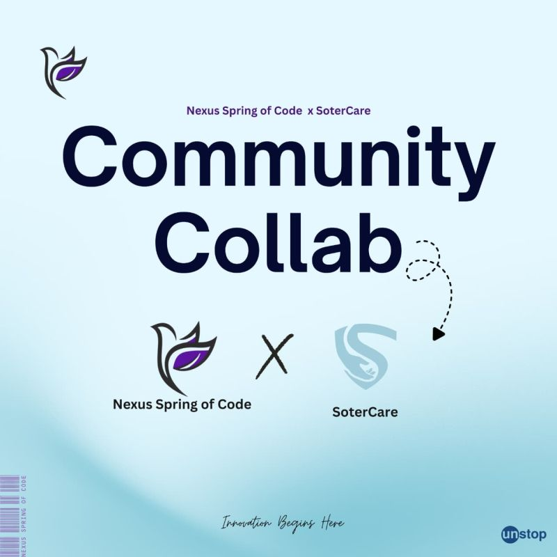

# 🌍 Events

Reports and records of SoterCare community events — meetups, talks, partner events, pitch events, and delegations.

## What lives here

One folder or file per event, named `YYYY-MM-DD-event-name/` (or `.md` for a single report). Each event should include a report based on the [Event Report template](../templates/event-report.md), plus links to slides ([`slides/`](../slides/)) and photos ([`photos/`](../photos/)).

## Past events

<table>
  <tr>
    <td align="center"> <b>U.S. Delegation Visit</b></td>
    <td align="center"> <b>CuttingEdge PROJEXPO</b></td>
    <td align="center"> <b>NIA Innovation Voucher</b></td>
    <td align="center"> <b>Nexus Spring of Code</b></td>
  </tr>
</table>

See [Media & Coverage](media-coverage.md) for the full dated list with links and photos:

- Algorand Foundation Workshop
- Solana Web3 Event
- VisioNEX Hackathon *(see [`hackathons/`](../hackathons/))*
- U.S. Delegation Visit — University of Oklahoma
- Hult Prize IIT
- CuttingEdge PROJEXPO

> 📝 Reports for these events are being added — a great [first contribution](../guides/first-contribution.md) if you attended one!

## Proposing an event

Open an [Event Proposal issue](https://github.com/SoterCare/community/issues/new/choose) and read the [Organizer Checklist](../templates/organizer-checklist.md).
