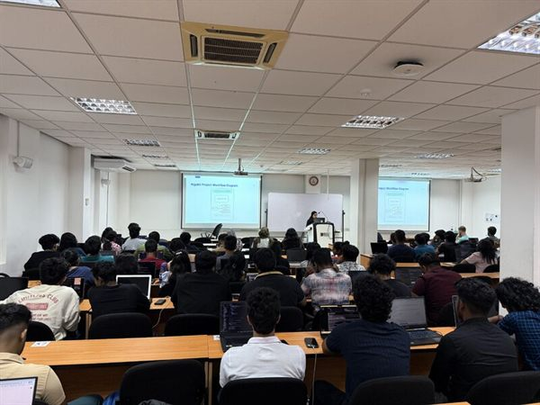
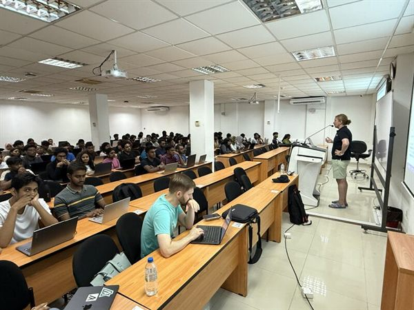
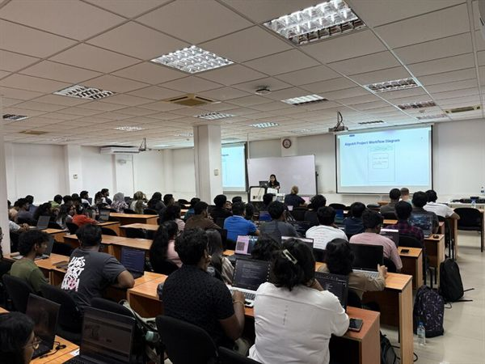

# ⛓️ Algorand Foundation Workshop

> AlgoKit 3.0 & TypeScript smart contracts — a hands-on blockchain workshop with the Algorand Foundation. **50+ students trained.**

**Date:** April 2026 · **Focus:** Blockchain / Web3 · **Partner:** Algorand Foundation · **Venue:** Informatics Institute of Technology (IIT)

## Overview

SoterCare hosted a hands-on Algorand workshop centered on **AlgoKit 3.0** and writing smart contracts in **TypeScript**, bringing the Algorand Foundation's tooling directly to students.

## Objectives

- Introduce students to blockchain development on Algorand
- Get everyone building with AlgoKit 3.0 hands-on, not just in theory
- Lower the barrier to Web3 for first-time blockchain developers

## Our Role

SoterCare organized and hosted the workshop — logistics, promotion, and student mentoring throughout the hands-on session — in collaboration with the Algorand Foundation.

## Event Highlights

- Live AlgoKit 3.0 walkthrough
- TypeScript smart-contract development from scratch
- Q&A with Algorand Foundation representatives

## Community Impact

- **50+** students trained in blockchain fundamentals
- Introduced many students to their first Web3 development experience
- Strengthened SoterCare's partnership with the Algorand Foundation

## Technologies

`Algorand` · `AlgoKit 3.0` · `TypeScript` · `Smart Contracts` · `Web3`

## Key Learnings

- Hands-on tooling (AlgoKit) turns an abstract topic into something students can build with in one session
- Pre-shared setup instructions keep a blockchain workshop moving

## Gallery

Full-resolution photos: [`photos/2026-04-01-algorand-workshop/`](../photos/2026-04-01-algorand-workshop/)

## Links

- 📰 [LinkedIn post](https://www.linkedin.com/posts/sanjulaherath_algorand-web3-blockchain-ugcPost-7445090561876795393-UDmt)
- 🔗 [Algorand partner page](../partners/algorand.md)

## Team

SoterCare community team. _Contributors who helped run this event — add your names via a PR._
