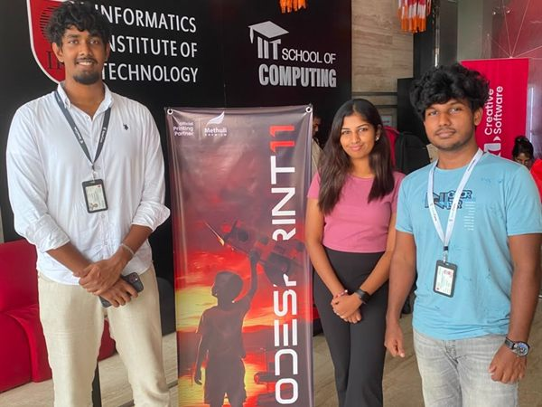

# 🥉 CodeSprint 11

> Team SoterCare — **3rd Place** at CodeSprint 11.

**Date:** 2026 · **Focus:** Competitive Programming / Innovation

## Overview

Team SoterCare competed in **CodeSprint 11** and placed **3rd**, demonstrating the team's technical and problem-solving strength.

## Objectives

- Compete against strong teams in a national coding competition
- Test and sharpen the team's technical skills under pressure

## Our Role

Team SoterCare participated as competitors.

## Event Highlights

- 🥉 3rd Place finish

## Community Impact

- Added a competitive-programming milestone to SoterCare's track record
- Motivated members toward algorithmic and problem-solving skills

## Technologies

`Problem Solving` · `Algorithms` · `Software Engineering`

## Key Learnings

- Competitive programming builds a different muscle than hackathons — both strengthen the team

## Gallery

Full-resolution photos: [`photos/2026-06-01-codesprint-11/`](../photos/2026-06-01-codesprint-11/)

## Links

- 🔗 [CodeSprint](https://www.linkedin.com/company/codesprintlk/) *(official SoterCare post link to be added)*

## Team

Team SoterCare. _Add participant names via a PR._
