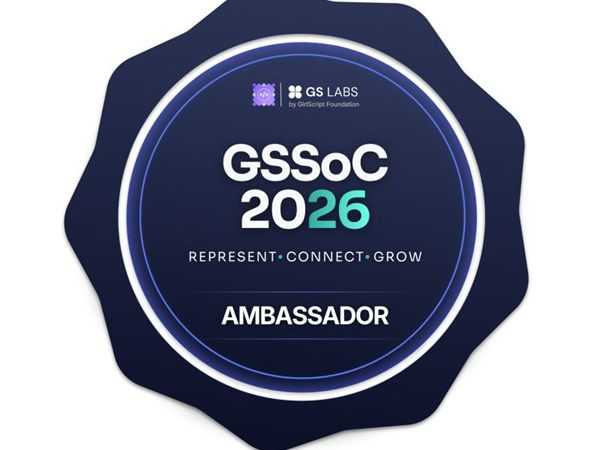
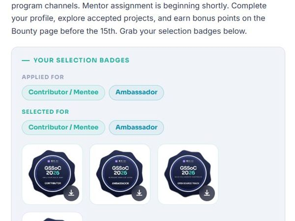

# 🌱 GirlScript Summer of Code 2026

> SoterCare as **Ambassador & Contributor** for GirlScript Summer of Code 2026 — championing open source and open-source-first learning.

**Date:** May 2026 · **Focus:** Open Source · **Program:** GirlScript Summer of Code

## Overview

SoterCare took part in **GirlScript Summer of Code 2026** as an **Ambassador & Contributor**, promoting open-source participation and an open-source-first approach to learning within the community.

## Objectives

- Encourage students to make their first open-source contributions
- Represent SoterCare in a major open-source program
- Strengthen SoterCare's open-source culture

## Our Role

Ambassador and contributor — advocating for the program and contributing to open source alongside students.

## Event Highlights

- Ambassador & Contributor recognition
- Open-source-first advocacy within the community
- Encouraging first-time contributors

## Community Impact

- Connected SoterCare members to a wider open-source ecosystem
- Reinforced open source as a core learning path — see our [First Contribution Guide](../guides/first-contribution.md)

## Technologies

`Open Source` · `Git` · `GitHub` · `Collaboration`

## Key Learnings

- Ambassador programs are a force-multiplier for getting students into open source

## Gallery

Full-resolution photos: [`photos/2026-05-18-gssoc-2026/`](../photos/2026-05-18-gssoc-2026/)

## Links

- 📰 [LinkedIn post](https://www.linkedin.com/posts/sanjulaherath_opensourcefirst-gssoc2026-opensource-activity-7462100045396488192-ZYhj)
- 🔗 [GirlScript Summer of Code partner page](../partners/gssoc.md)

## Team

SoterCare community. _Add contributor names via a PR._
