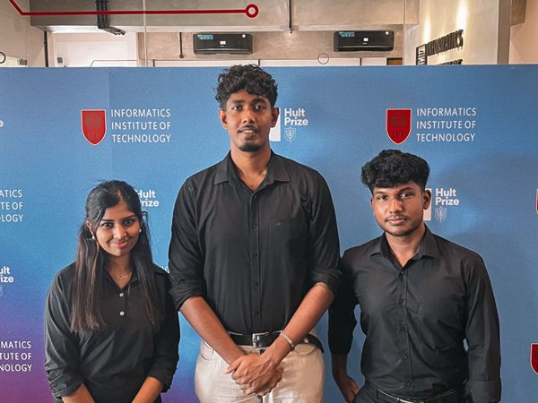

# 🏆 Hult Prize IIT

> Team SoterCare at the Hult Prize IIT qualifier — advancing as a **Hult Prize Finalist.**

**Date:** February 2026 · **Focus:** Social Entrepreneurship / Innovation · **Venue:** Informatics Institute of Technology (IIT)

## Overview

Team SoterCare competed in the **Hult Prize** at the IIT qualifier, pitching a socially impactful venture and earning **Finalist** recognition.

## Objectives

- Pitch SoterCare as a socially impactful healthcare venture
- Compete in one of the world's largest student social-entrepreneurship competitions
- Sharpen the team's business and impact thinking

## Our Role

Team SoterCare participated as competitors, presenting their venture to judges.

## Event Highlights

- Competitive pitch at the Hult Prize IIT qualifier
- Recognition as a Hult Prize Finalist

## Community Impact

- Positioned SoterCare among top student ventures
- Reinforced the community's focus on real-world, impact-driven technology

## Technologies

`Social Entrepreneurship` · `Healthcare Technology` · `Pitching` · `Impact`

## Key Learnings

- Framing technology around measurable social impact resonates with judges
- Entrepreneurship competitions build skills that pure hackathons don't

## Gallery

Full-resolution photos: [`photos/2026-02-21-hult-prize-iit/`](../photos/2026-02-21-hult-prize-iit/)

## Links

- 📰 [LinkedIn post](https://www.linkedin.com/posts/sotercare_teamsotercare-hultprize-hultprizeiit-activity-7430916330922618880-7A0L)

## Team

Team SoterCare. _Add participant names via a PR._
