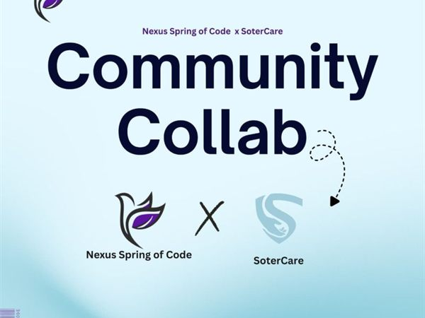
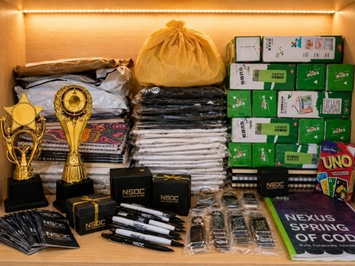
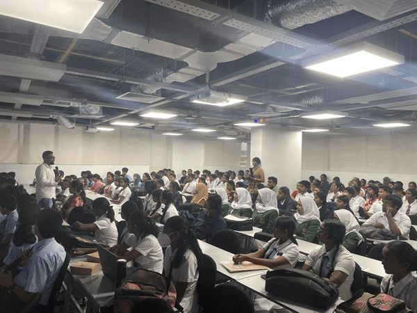
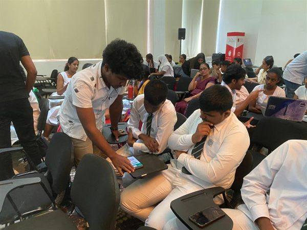
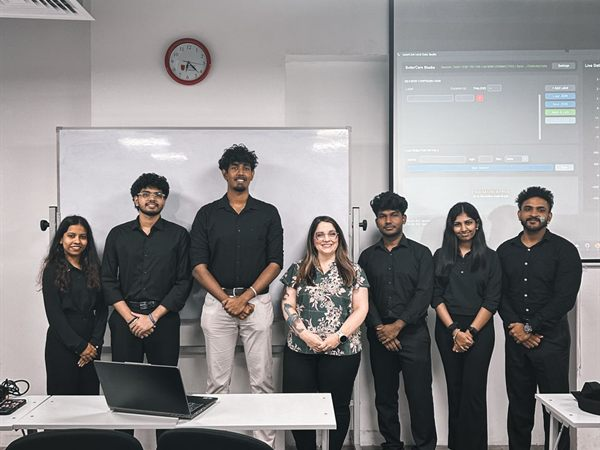
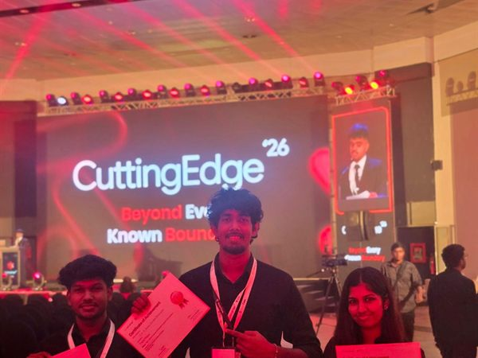

# 📰 Media & Coverage

Public coverage of SoterCare community events and milestones — the evidence trail of what we've done together, with photos inline so you can browse it all right here. Full albums are on the linked posts.

## 🚀 Open Source & Community

| Date | Event | Coverage | Photo |
| --- | --- | --- | --- |
| 2026-05-06 | Nexus Spring of Code × SoterCare collaboration | [LinkedIn](https://www.linkedin.com/posts/nso-code_we-are-soo-happy-to-announce-our-super-amazing-activity-7457802612369809408-7Dww) |  |
| 2026-06-27 | Nexus Spring of Code — Season 1 recognition | [LinkedIn](https://www.linkedin.com/posts/harsha-nandi-65a05b212_end-of-the-season-1-of-nexus-spring-of-code-activity-7476561588850900994-Zi-e) |  |
| 2026-05-18 | GirlScript Summer of Code 2026 — Ambassador & Contributor | [LinkedIn](https://www.linkedin.com/posts/sanjulaherath_opensourcefirst-gssoc2026-opensource-activity-7462100045396488192-ZYhj) |  |

## ⛓️ Blockchain & Web3

| Date | Event | Coverage | Photo |
| --- | --- | --- | --- |
| 2026-04-01 | Algorand Foundation Workshop (AlgoKit 3.0) | [LinkedIn](https://www.linkedin.com/posts/sanjulaherath_algorand-web3-blockchain-ugcPost-7445090561876795393-UDmt) |  |
| 2024-12-28 | Solana Community Event | [LinkedIn](https://www.linkedin.com/posts/sanjulaherath_solanaecosystem-web3revolution-solana-ugcPost-7278687216892067840--UNg) |  |

## 🏆 Hackathons

| Date | Event | Coverage | Photo |
| --- | --- | --- | --- |
| 2026-06-12 | VisioNEX Hackathon 1 | [LinkedIn](https://www.linkedin.com/posts/sanjulaherath_visionexhackathon-innovation-futuretech-activity-7471187222076059648-dJLC) |  |
| 2026-07-18 | VisioNEX Hackathon 2 | [LinkedIn](https://www.linkedin.com/posts/sanjulaherath_visionexhackathon-hackathon-innovation-ugcPost-7484248701608058880-4Uop) |  |
| | CodeSprint 11 — 3rd Place | [CodeSprint](https://www.linkedin.com/company/codesprintlk/) *(post link to be added)* | |

## 💡 Innovation & Entrepreneurship

| Date | Event | Coverage | Photo |
| --- | --- | --- | --- |
| 2026-01-26 | U.S. Delegation Visit — University of Oklahoma | [LinkedIn](https://www.linkedin.com/posts/sotercare_usdelegationvisit-universityofoklahoma-sdgp-activity-7421608313454292993-W-ZG) |  |
| 2026-02-21 | Hult Prize IIT Qualifier | [LinkedIn](https://www.linkedin.com/posts/sotercare_teamsotercare-hultprize-hultprizeiit-activity-7430916330922618880-7A0L) |  |
| 2026-07-01 | CuttingEdge 2026 PROJEXPO — 2nd Runner-Up, Best SDGP Project | [LinkedIn](https://www.linkedin.com/posts/sotercare_sotercare-cuttingedge2026-projexpo-ugcPost-7477986575285612545-iGpa) |  |
| 2026-06-28 | NIA Innovation Voucher Programme 2026 | [LinkedIn](https://www.linkedin.com/posts/sotercare_teamsotercare-nia-innovationvoucherprogramme-activity-7476913645289918464-1NY4) |  |

## 👥 Community Memberships

IEEE (Computer Society, Robotics & Automation Society, Women in Engineering) · AWS Cloud Club · GirlScript Summer of Code · Nexus Spring of Code (Community Partner)

---

*Adding coverage: one row per event, dated `YYYY-MM-DD`, newest within each section first. Photos go in `photos/YYYY-MM-DD-event-slug/` as `thumb-01.jpg`, `thumb-02.jpg`, … — the table embeds `thumb-01.jpg` at `width="160"`, and the folder link holds the full set.*
