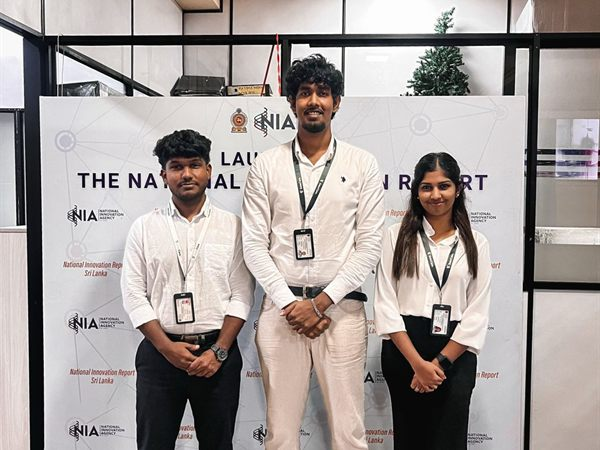

# 🚀 NIA Innovation Voucher Programme 2026

> Team SoterCare selected for the **NIA Innovation Voucher Programme 2026** — support for turning innovation into real-world impact.

**Date:** June 2026 · **Focus:** Innovation / Entrepreneurship

## Overview

SoterCare was **selected for the NIA Innovation Voucher Programme 2026**, recognizing the team's innovation potential and supporting the next stage of its healthcare-technology work.

## Objectives

- Secure support to advance SoterCare's innovation
- Validate the venture through a competitive selection process
- Move from prototype toward real-world impact

## Our Role

Team SoterCare applied to and was selected for the programme.

## Event Highlights

- Selection into the NIA Innovation Voucher Programme 2026
- Recognition of SoterCare's innovation and potential

## Community Impact

- External validation of SoterCare's direction
- Resources and recognition to grow the team's work

## Technologies

`Innovation` · `Healthcare Technology` · `Entrepreneurship`

## Key Learnings

- Programme selection rewards a clear innovation story backed by demonstrated progress

## Gallery

Full-resolution photos: [`photos/2026-06-28-nia-innovation-voucher/`](../photos/2026-06-28-nia-innovation-voucher/)

## Links

- 📰 [LinkedIn post](https://www.linkedin.com/posts/sotercare_teamsotercare-nia-innovationvoucherprogramme-activity-7476913645289918464-1NY4)

## Team

Team SoterCare. _Add participant names via a PR._
