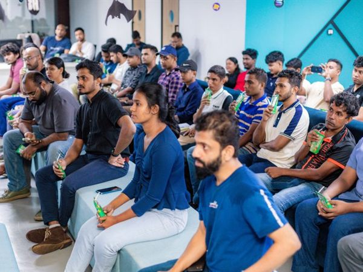

# ⛓️ Solana Community Event

> Exploring the Solana ecosystem and the Web3 revolution — SoterCare's first Web3 community activity.

**Date:** December 2024 · **Focus:** Blockchain / Web3 · **Community:** Solana

## Overview

An early SoterCare community event exploring the **Solana ecosystem** and the broader Web3 movement — introducing students to high-performance blockchain development.

## Objectives

- Introduce students to the Solana ecosystem
- Spark interest in Web3 and decentralized applications
- Build early momentum for SoterCare's blockchain community

## Our Role

SoterCare organized and led the session, connecting students with the Solana community and Web3 concepts.

## Event Highlights

- Overview of the Solana ecosystem and its developer tooling
- Discussion of real-world Web3 use cases
- Community networking around blockchain

## Community Impact

- One of SoterCare's first blockchain community activities
- Laid the groundwork for later Web3 events, including the [Algorand Foundation Workshop](algorand-workshop.md)

## Technologies

`Solana` · `Web3` · `Blockchain` · `Decentralized Applications`

## Key Learnings

- Early ecosystem-overview events are a low-barrier way to grow interest before hands-on workshops

## Gallery

Full-resolution photos: [`photos/2024-12-28-solana-web3-event/`](../photos/2024-12-28-solana-web3-event/)

## Links

- 📰 [LinkedIn post](https://www.linkedin.com/posts/sanjulaherath_solanaecosystem-web3revolution-solana-ugcPost-7278687216892067840--UNg)

## Team

SoterCare community team. _Contributors who helped run this event — add your names via a PR._
