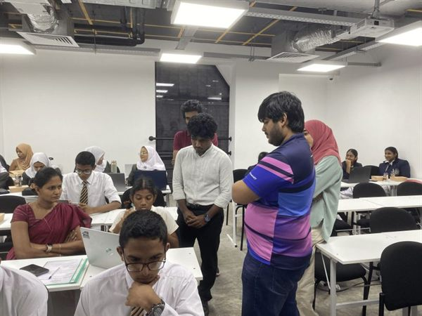
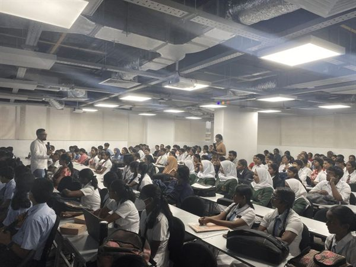
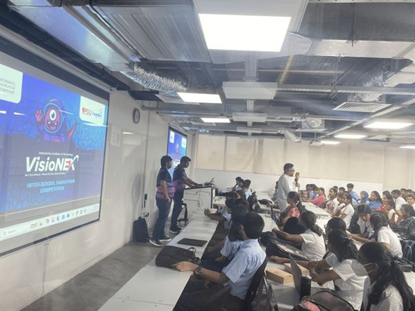
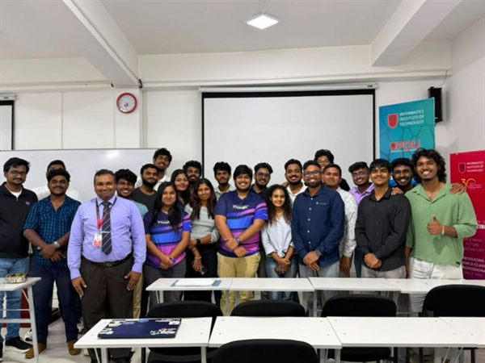

# 🚀 VisioNEX Hackathon 1

> The first edition of VisioNEX — SoterCare's flagship hackathon bringing innovation and future tech to students.

**Date:** June 2026 · **Focus:** Hackathon / Innovation · **Venue:** Informatics Institute of Technology (IIT)

## Overview

VisioNEX Hackathon 1 was the launch edition of SoterCare's flagship hackathon, designed to introduce students to innovation, future technology, and hands-on building under time pressure.

## Objectives

- Give students a real hackathon experience
- Encourage innovation around future-facing technology
- Build a pipeline of young builders for the SoterCare community

## Our Role

SoterCare organized and ran VisioNEX 1 end to end — venue, format, mentoring, and judging.

## Event Highlights

- Full auditorium of engaged student participants
- Mentorship throughout the build
- Innovation-focused challenges and presentations

## Community Impact

- Introduced many students to their first hackathon
- Set the stage for the larger [VisioNEX Hackathon 2](visionex-hackathon-2.md)
- Strengthened SoterCare's reputation as a student community that ships events

## Technologies

`Innovation` · `Future Tech` · `Rapid Prototyping` · `Team Building`

## Key Learnings

- A strong first edition builds the credibility and turnout for the next one
- School and university students respond to structure + mentorship

## Gallery

Full-resolution photos: [`photos/2026-06-12-visionex-hackathon-1/`](../photos/2026-06-12-visionex-hackathon-1/)

## Links

- 📰 [LinkedIn post](https://www.linkedin.com/posts/sanjulaherath_visionexhackathon-innovation-futuretech-activity-7471187222076059648-dJLC)
- 🚀 [VisioNEX hackathon series](../hackathons/visionex/)

## Team

- Sanjula Herath
- Daham Dissanayake
- Komudi Senarachchi

_Add other organizers and mentors via a PR._
