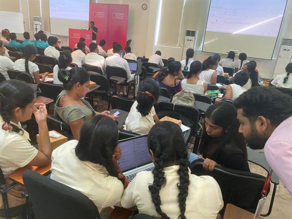
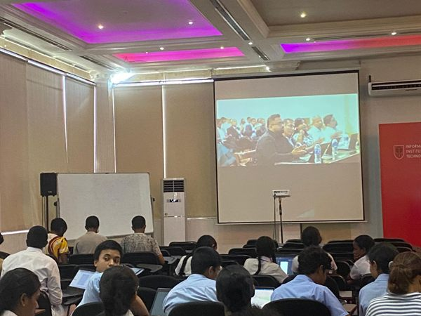

# 🚀 VisioNEX Hackathon 2

> The second edition of VisioNEX — SoterCare's largest hackathon yet. **500+ school students from 40+ schools.**

**Date:** July 2026 · **Focus:** Hackathon / Innovation · **Venue:** Informatics Institute of Technology (IIT)

## Overview

VisioNEX Hackathon 2 scaled the flagship event dramatically, engaging **500+ school students from 40+ schools** in a multi-day hackathon focused on innovation and community building.

## Objectives

- Reach school students across many institutions and spark their interest in tech
- Provide structured mentorship for young, first-time hackers
- Grow SoterCare's community-building footprint

## Our Role

SoterCare organized and ran VisioNEX 2 — outreach to 40+ schools, event logistics, mentoring, and judging.

## Event Highlights

- **500+** school students participating
- **40+** schools represented
- Multi-day format with mentorship and innovation challenges
- Community building at scale

## Community Impact

- SoterCare's largest community event to date by reach
- Introduced hundreds of school students to hackathons and building with technology
- Deepened SoterCare's relationships across the school ecosystem

## Technologies

`Innovation` · `Future Tech` · `Rapid Prototyping` · `Mentorship` · `Community Building`

## Key Learnings

- Broad school outreach (40+ schools) multiplies reach far beyond a single campus
- Young students thrive with structure, mentorship, and clear challenges

## Gallery

Full-resolution photos: [`photos/2026-07-18-visionex-hackathon-2/`](../photos/2026-07-18-visionex-hackathon-2/)

## Links

- 📰 [LinkedIn post](https://www.linkedin.com/posts/sanjulaherath_visionexhackathon-hackathon-innovation-ugcPost-7484248701608058880-4Uop)
- 🚀 [VisioNEX hackathon series](../hackathons/visionex/)

## Team

- Sanjula Herath
- Daham Dissanayake
- Komudi Senarachchi

_Add other organizers and mentors via a PR._
