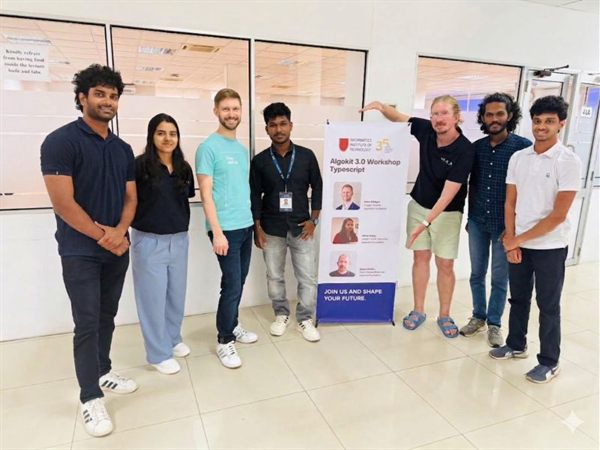
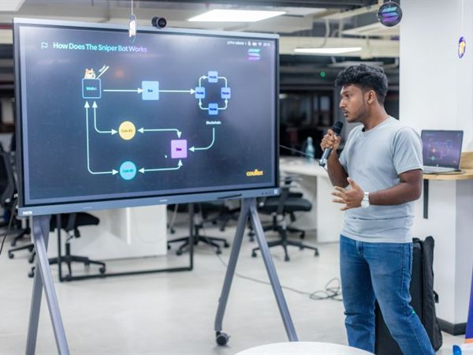

# 🎓 Workshops

Materials and reports from SoterCare's hands-on workshops — AI, Cloud Computing, Blockchain (Algorand & Solana), developer bootcamps, and technical talks.

## What lives here

One folder per workshop, named `YYYY-MM-DD-topic/`, containing:

- `report.md` — based on the [Workshop Report template](../templates/workshop-report.md)
- `code/` — sample code and exercises (if any)
- Links to slides in [`slides/`](../slides/) and photos in [`photos/`](../photos/)

## Highlights

<table>
  <tr>
    <td align="center"> <b>Algorand Foundation Workshop</b> — 50+ students trained</td>
    <td align="center"> <b>Solana Community Event</b></td>
  </tr>
</table>

More in [Media & Coverage](../events/media-coverage.md).

## Run a workshop

1. Read [How to Organize a Workshop](../guides/organize-a-workshop.md)
2. Open a [Workshop Proposal issue](https://github.com/SoterCare/community/issues/new/choose)
3. Use the [Event Checklist](../templates/event-checklist.md) on the day
